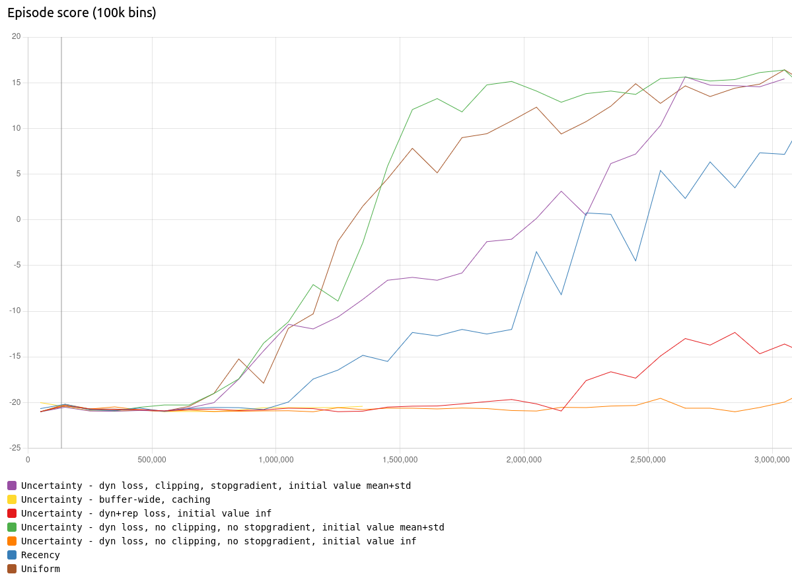
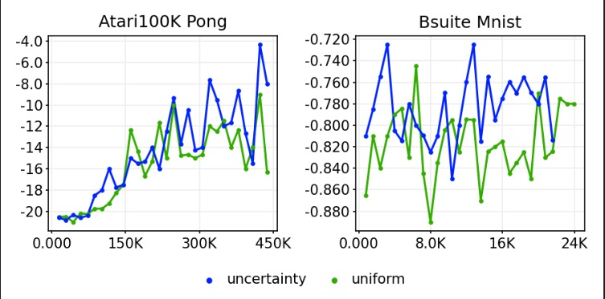

# Mastering Diverse Domains through World Models

A reimplementation of [DreamerV3][paper], a scalable and general reinforcement
learning algorithm that masters a wide range of applications with fixed
hyperparameters.


If you find this code useful, please reference in your paper:

```
@article{hafner2023dreamerv3,
  title={Mastering Diverse Domains through World Models},
  author={Hafner, Danijar and Pasukonis, Jurgis and Ba, Jimmy and Lillicrap, Timothy},
  journal={arXiv preprint arXiv:2301.04104},
  year={2023}
}
```

To learn more:

- [Research paper][paper]
- [Project website][website]
- [Twitter summary][tweet]

## DreamerV3

DreamerV3 learns a world model from experiences and uses it to train an actor
critic policy from imagined trajectories. The world model encodes sensory
inputs into categorical representations and predicts future representations and
rewards given actions.


DreamerV3 masters a wide range of domains with a fixed set of hyperparameters,
outperforming specialized methods. Removing the need for tuning reduces the
amount of expert knowledge and computational resources needed to apply
reinforcement learning.


Due to its robustness, DreamerV3 shows favorable scaling properties. Notably,
using larger models consistently increases not only its final performance but
also its data-efficiency. Increasing the number of gradient steps further
increases data efficiency.


## Related work

Other research papers citing DreamerV3 have also explored Experience Replay-related research questions. To briefly summarize them and their findings:

- [Curious Replay](https://doi.org/10.48550/arXiv.2306.15934): Uses curiosity-driven prioritized experience replay (combining count-based and adversarial signals) to outperform vanilla DreamerV3 on the Crafter benchmark.
- [WMAR](https://doi.org/10.48550/arXiv.2401.16650): Extends DreamerV3 to continual learning using a memory-efficient, distribution-matching buffer. Especially effective in environments without shared structure.
- [Domberg & Schildbach](https://doi.org/10.48550/arXiv.2503.02552): Proposes uncertainty estimation via reconstruction error to detect unreliable policy decisions, useful for safety mechanisms like emergency stops.
- [SimuDICE](https://doi.org/10.48550/arXiv.2412.06486): Addresses the mismatch between world model training (prediction) and usage (planning), balancing common and rare experiences via DICE-based sampling.

## Our extension
DreamerV3 uses uniform sampling on the replay buffer to form training batches. While this is a simple and efficient approach, it treats all items in the buffer equally. In reality, some experiences can be more useful to learn from than others. We introduce uncertainty-based priority sampling. This approach leverages model uncertainty, defined as the unclipped dynamics loss, in combination with a sum-tree for efficient sampling and updating. The method uses predictions made during training to compute uncertainty values, thus requiring no additional forward passes. 

## Results
We experimented with different versions of uncertainty sampling: 
- Sum-tree with the added dynamics and representation loss as priority signal
- Sum-tree with the clipped dynamics loss as priority signal and initial values as the mean+std of the distribution
- Sum-tree with the unclipped dynamics loss as priority signal and initial value as `float('inf')`
- Sum-tree with the unclipped dynamics loss as priority signal and initial value as mean+std of the distribution
- Priority caching with buffer-updates every N steps (very slow, so we only ran 1.3M steps) 

We compare this to two baselines: uniform sampling (base DreamerV3) and recency sampling. On the pong game from the Atari suite, we obtained the following results: 
 

The version with unclipped dynamics loss as priority signal and mean+std as initial value improves on the base DreamerV3 by obtaining a higher learning speed and quicker convergence than the original DreamerV3 model with uniform sampling, while only requiring 1 extra hour of training time. 

On the BSuite and Atari100K, our method also performs better: 


## Conclusion
This work shows that uncertainty-based priority sampling enables faster learning and quicker convergence, while only requiring minimal additional overhead. 

For future work, the method can be tested on more diverse suites. 

## Contributions:
- Bart: Implemented all uncertainty sampling methods as well as recency sampling. Ran experiments on atari and atari100k and visualized all results. Maintained and cleaned codebase. Wrote methodology section in the paper. 
- Fiona:
- Julia: Fixed bugs regarding JAX and priorized sampling. Fixed and ran implementation of BSuite. Collaborated on the Introduction and wrote the Related Work section.
- Robbert:

# Instructions

The code has been tested on Linux and Mac and requires Python 3.11+. Follow instructions below to run the model.

## Docker

You can either use the provided `Dockerfile` that contains instructions or
follow the manual instructions below.

To build the docker image, run (with sudo): 
```sh
docker build -f Dockerfile -t img .
```
Or use compose build:
```sh
docker compose build
```

Then, to create the container and run the application with your preferred settings:
```sh
docker run -it --gpus all --rm -v ~/logdir/docker:/logdir img \
  python dreamerv3/main.py --logdir /logdir/{timestamp} --configs atari size1m <or add config flags here>
```
If you update the Dockerfile or the contents of its build directory, you have to rebuild the docker image. This is done with: 
```sh
docker compose build
```

## Conda
First set up the environment:
```sh
conda env create -n dreamer -f requirements.txt
conda activate dreamer
```
Then run the model with:
```sh
python dreamerv3/main.py \
  --logdir ~/logdir/dreamer/{timestamp} \ 
  --configs atari size1m <or add configs here> \
```


## Manual

Install [JAX][jax] and then the other dependencies:

```sh
pip install -U -r requirements.txt
```

Training script:

```sh
python dreamerv3/main.py \
  --logdir ~/logdir/dreamer/{timestamp} \
  --configs crafter \
  --run.train_ratio 32
```

To reproduce results, train on the desired task using the corresponding config,
such as `--configs atari --task atari_pong`.

View results:

```sh
pip install -U scope
python -m scope.viewer --basedir ~/logdir --port 8000
```

Scalar metrics are also writting as JSONL files.

## Configs
There are a number of preset configs you can use: 

### Model sizes 
Models are available from 1M parameters to 400M. 200M is the default.

- `size1m`
- `size12m`
- `size25m`
- `size50m`
- `size100m`
- `size200m`
- `size400m`

### Tasks
The following tasks can be run with these config flags. Other tasks can be run by setting it manually in the `dreamerv3/configs.yaml`. 

- `minecraft`
- `dmlab`, runs the 'explore_goal_locations_small' task
- `atari`, runs the pong game
- `procgen`, runs the coinrun game
- `atari100K`, runs the pong game
- `crafter`, 
- `dmc_proprio`, runs the walker task
- `dmc_vision`, runs the walker task
- `bsuite`, runs the mnist task
- `loconav`, runs the ant maze task

### Sampling methods
To run different sampling methods for experience replay, set the following config flags: 

- `uncertainty`, this runs prioritized sampling, using the uncertainty signal with the mean+std of the distribution as initial value. This is the best-performing setting and also the default.
- `uncertainty_inf`, also prioritized sampling with the uncertainty signal, but with 'inf' as initial value.
- `uncertainty_caching`, this runs buffer wide uncertainty calculation every 2k steps and does weighted sampling. Very slow. 
- `uniform`, standard uniform sampling. The default method of base DreamerV3. 
- `priority`, prioritized sampling using the dynamics and representation loss as priority signal, with 'inf' as initial value. 
- `recency`, weighted sampling with higher probabilities for more recently added sequences. 

### Debug
For debugging, you can run use the `debug` config flag. This runs the model of 15k parameters on CPU only. 


# Tips

- All config options are listed in `dreamerv3/configs.yaml` and you can
  override them as flags from the command line.
- The `debug` config block reduces the network size, batch size, duration
  between logs, and so on for fast debugging (but does not learn a good model).
- By default, the code tries to run on GPU. You can switch to CPU or TPU using
  the `--jax.platform cpu` flag.
- You can use multiple config blocks that will override defaults in the
  order they are specified, for example `--configs crafter size50m`.
- By default, metrics are printed to the terminal, appended to a JSON lines
  file, and written as Scope summaries. Other outputs like WandB and
  TensorBoard can be enabled in the training script.
- If you get a `Too many leaves for PyTreeDef` error, it means you're
  reloading a checkpoint that is not compatible with the current config. This
  often happens when reusing an old logdir by accident.
- If you are getting CUDA errors, scroll up because the cause is often just an
  error that happened earlier, such as out of memory or incompatible JAX and
  CUDA versions. Try `--batch_size 1` to rule out an out of memory error.
- Many environments are included, some of which require installing additional
  packages. See the `Dockerfile` for reference.
- To continue stopped training runs, simply run the same command line again and
  make sure that the `--logdir` points to the same directory.

# Disclaimer

This repository contains a reimplementation of DreamerV3 based on the open
source DreamerV2 code base. It is unrelated to Google or DeepMind. The
implementation has been tested to reproduce the official results on a range of
environments.

[jax]: https://github.com/google/jax#pip-installation-gpu-cuda
[paper]: https://arxiv.org/pdf/2301.04104v1.pdf
[website]: https://danijar.com/dreamerv3
[tweet]: https://twitter.com/danijarh/status/1613161946223677441
